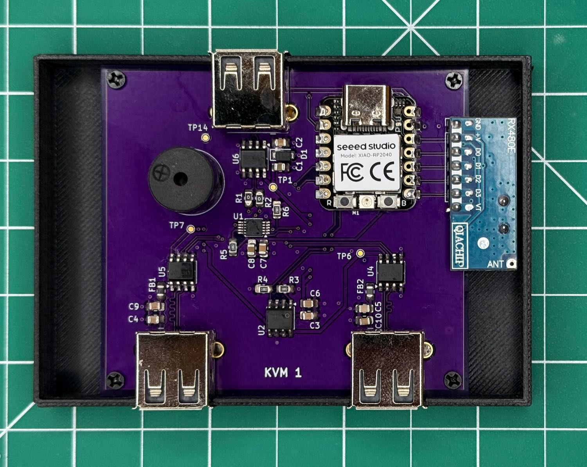

# USB Switch

This is a programmable USB 2.0 switch that allows only one of two USB devices to be connected to a  USB host at a time. The board switches both data and power, so a port is fully disconnected when it is not selected. Switching can be controlled by a button or by an external module.

This device is not a USB hub, neither logically nor internally.
The switch is unidirectional: it cannot switch a single USB peripheral between two USB hosts.

### Files

* _3d\_models_ - files for 3D printing
* _src_ - source code for the controller
* _schematics_ - KiCad project for the board

Check [Releases](https://github.com/lennyomg/usb-switch/releases/latest) for Gerber files, BOM, schematic PDFs, etc.

### Details

TODO

### Application

I added an external [433MHz radio garage door opener receiver](https://www.amazon.com/dp/B09P89RF8R) module and now I can switch between two wireless CarPlay adapters using my car HomeLink garage opener button.

### License

Hardware design files are licensed under the CERN-OHL-P-2.0 license. Source code files are licensed under the MIT license. This project is provided “as is”, without warranty of any kind.
